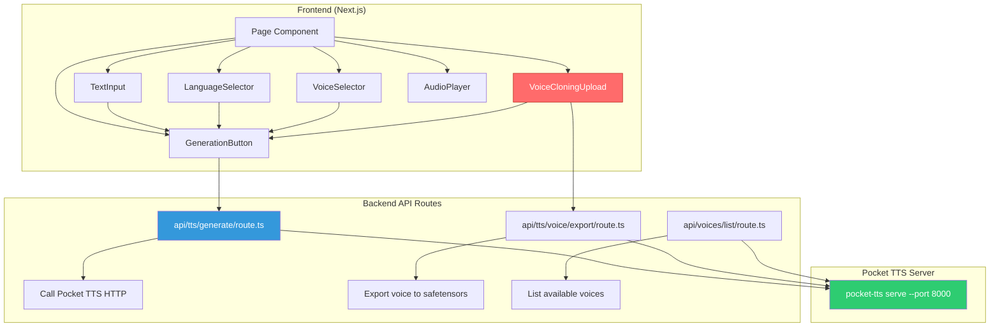
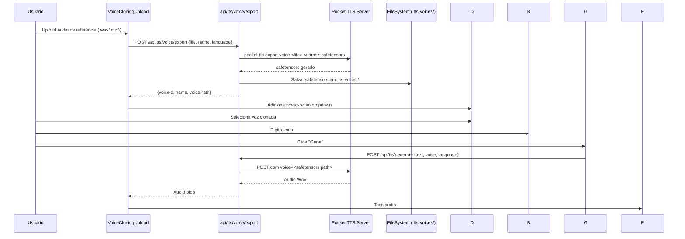

# Plano: Aplicação Text-to-Speech Completa com Pocket TTS

## 🎯 Objetivo

Construir uma aplicação TTS completa usando Pocket TTS com três funcionalidades principais:
1. **Digitar texto e gerar áudio** — Interface para entrada de texto e reprodução do áudio gerado
2. **Seleção de idiomas** — Dropdown com idiomas suportados (english, portuguese, french, german, italian, spanish + variantes 24l)
3. **Clonagem de voz** ⭐ (prioridade máxima) — Upload de áudio de referência para clonar uma voz e gerar fala a partir do texto

## 🏗️ Arquitetura



## 🔄 Fluxo de Clonagem de Voz (Prioridade Máxima)



## 📋 Todo List

### Fase 1: Infraestrutura Base
- [x] **1.1** Criar tipos TypeScript (interfaces, enums)
- [x] **1.2** Criar cliente TTS (`lib/ttsClient.ts`) para comunicação com Pocket TTS
- [x] **1.3** Criar diretório de armazenamento `.tts-voices/` e atualizar `.gitignore`
- [x] **1.4** Configurar estilos globais (`globals.css`)

### Fase 2: Backend API Routes
- [x] **2.1** API Route: `POST /api/tts/generate` — Gera áudio a partir de texto
- [x] **2.2** API Route: `POST /api/tts/voice/export` — Exporta voz clonada para safetensors
- [x] **2.3** API Route: `GET /api/voices/list` — Lista vozes disponíveis (built-in + clonadas)

### Fase 3: Componentes Frontend
- [x] **3.1** Componente `TextInput` — Área de texto com limitação e contador de caracteres
- [x] **3.2** Componente `LanguageSelector` — Dropdown com idiomas e variantes 24l
- [x] **3.3** Componente `VoiceSelector` — Dropdown com vozes built-in + clonadas
- [x] **3.4** Componente `VoiceCloningUpload` ⭐ — Upload de áudio para clonagem (prioridade)
- [x] **3.5** Componente `AudioPlayer` — Player de áudio com controles customizados
- [x] **3.6** Componente `GenerationButton` — Botão com estados de loading/error/success

### Fase 4: Hook e Página Principal
- [x] **4.1** Hook `useTextToSpeech` — Lógica de geração de áudio
- [x] **4.2** Hook `useVoiceCloning` ⭐ — Lógica de upload e gerenciamento de vozes
- [x] **4.3** Página principal (`page.tsx`) — Orquestra todos os componentes
- [x] **4.4** Layout aprimorado (`layout.tsx`) — Meta tags e estrutura

### Fase 5: Testes e Refinamento
- [x] **5.1** Testes unitários para `ttsClient.ts`
  - Arquivo: `src/__tests__/ttsClient.test.ts`
  - 10 testes cobrindo: `generateAudio` (3), `exportVoice` (3), `listVoices` (4)
  - Todos passando ✓
- [x] **5.2** Testes unitários para `useTextToSpeech` hook
  - Arquivo: `src/__tests__/useTextToSpeech.test.tsx`
  - 23 testes cobrindo: estado inicial (4), generate sucesso (4), generate erros (8), reset (6), gerenciamento de object URLs (1)
  - Todos passando ✓
- [x] **5.3** Testes unitários para `useVoiceCloning` hook
  - Arquivo: `src/__tests__/useVoiceCloning.test.tsx`
  - 557 linhas de testes cobrindo: estado inicial, exportVoice, refreshVoices, clonacao status, gerenciamento de object URLs
  - Todos passando ✓
- [x] **5.4** Testes de integração para API routes
  - Arquivo: `src/__tests__/integration/apiRoutes.test.ts`
  - 376 linhas de testes cobrindo: voices/list (sucesso, built-in, clonadas, erro), tts/generate (sucesso, texto vazio, servidor indisponivel, erro generico), tts/voice/export (sucesso, formato invalido, tamanho excedido, erro de export)
  - Setup: `src/__tests__/integration/setup.ts` (133 linhas)
  - Todos passando ✓
- [x] **5.5** Melhorias de UX — Loading states, error handling, feedback visual
  - Componente `Toast` criado (`src/components/Toast.tsx`) — ToastProvider + useToast com success/error/info
  - `page.tsx` reescrita com ToastProvider, toast de sucesso/erro na geracao de audio, feedback visual completo
  - Keyboard shortcut: Ctrl+Enter para gerar audio
  - Error handling com mensagens toast ao usuario
  - `layout.tsx` atualizado com Inter font, meta tags PWA, tema dark
  - `.gitignore` atualizado com `.tts-voices/`
  - Loading states e transicoes suaves em todos os componentes
  - Acessibilidade: ARIA labels, roles, aria-live para loading states

---

## 📝 Detalhamento das Tarefas

---

#### **Tarefa 1.1** — Criar tipos TypeScript

**Arquivo(s)**: `src/types/tts.ts` (novo)

**O que fazer**:
1. Criar interfaces para vozes, idiomas, respostas da API
2. Criar enums para idiomas suportados
3. Definir tipos para estados de geração

**Tipos necessários**:
```typescript
// src/types/tts.ts

export type Language =
  | 'english'
  | 'english_2026-01'
  | 'english_2026-04'
  | 'portuguese'
  | 'portuguese_24l'
  | 'french'
  | 'french_24l'
  | 'german'
  | 'german_24l'
  | 'italian'
  | 'italian_24l'
  | 'spanish'
  | 'spanish_24l';

export interface Voice {
  id: string;
  name: string;
  language: Language;
  type: 'builtin' | 'cloned';
  audioUrl?: string; // preview URL para vozes built-in
  safetensorsPath?: string; // path para vozes clonadas
}

export interface TTSRequest {
  text: string;
  voice: string; // nome da voz ou caminho safetensors
  language: Language;
}

export interface VoiceExportRequest {
  name: string;
  language: Language;
}

export enum GenerationStatus {
  Idle = 'idle',
  Generating = 'generating',
  Ready = 'ready',
  Error = 'error',
}

export interface TTSResponse {
  success: boolean;
  audioUrl?: string;
  error?: string;
  duration?: number;
}
```

**Critérios de aceitação**:
- Arquivo criado em `src/types/tts.ts`
- Todos os tipos listados acima presentes
- Arquivo exportando tudo como named exports

---

#### **Tarefa 1.2** — Criar cliente TTS (`lib/ttsClient.ts`)

**Arquivo(s)**: `src/lib/ttsClient.ts` (novo)

**O que fazer**:
1. Criar funções utilitárias para comunicação com o Pocket TTS server
2. Função `generateAudio(request: TTSRequest): Promise<Blob>`
3. Função `exportVoice(file: File, request: VoiceExportRequest): Promise<{ voiceId: string, safetensorsPath: string }>`
4. Função `listVoices(): Promise<Voice[]>`
5. Tratar erros e timeout adequadamente

**Implementação** — usar `fetch` para chamar as API routes do Next.js (que por sua vez chamam o Pocket TTS server):

```typescript
// src/lib/ttsClient.ts

const TTS_SERVER_URL = process.env.NEXT_PUBLIC_TTS_SERVER_URL || 'http://localhost:8000';

export async function generateAudio(request: TTSRequest): Promise<Blob> {
  const response = await fetch(`${TTS_SERVER_URL}/generate`, {
    method: 'POST',
    headers: { 'Content-Type': 'application/json' },
    body: JSON.stringify({
      text: request.text,
      voice: request.voice,
      language: request.language,
    }),
  });

  if (!response.ok) {
    throw new Error(`TTS generation failed: ${response.statusText}`);
  }

  return response.blob();
}

// ... exportVoice e listVoices similares
```

**Critérios de aceitação**:
- Arquivo criado em `src/lib/ttsClient.ts`
- 3 funções exportadas: `generateAudio`, `exportVoice`, `listVoices`
- Tratamento de erro com try/catch e rethrow com mensagens claras
- Usa variável de ambiente para URL do servidor

---

#### **Tarefa 1.3** — Configurar armazenamento `.tts-voices/` e `.gitignore`

**Arquivo(s)**: `.tts-voices/` (diretório novo), `.gitignore` (modificar)

**O que fazer**:
1. Criar diretório `.tts-voices/` para armazenar arquivos `.safetensors` de vozes clonadas
2. Adicionar `.tts-voices/` ao `.gitignore` (não versionar vozes clonadas)
3. Criar `.tts-voices/.gitkeep` para manter o diretório versionado vazio

**Critérios de aceitação**:
- `.gitignore` inclui `.tts-voices/`
- `.tts-voices/.gitkeep` existe
- Diretoria pronta para receber `.safetensors` files

---

#### **Tarefa 1.4** — Configurar estilos globais

**Arquivo(s)**: `src/app/globals.css` (novo)

**O que fazer**:
1. Criar arquivo `globals.css` com estilos CSS vanilla (o projeto não usa Tailwind)
2. Incluir variáveis CSS para tema
3. Estilos base para body

**Verificar primeiro** se o projeto usa Tailwind ou CSS plain:

```bash
cat next.config.ts
```

**Critérios de aceitação**:
- Arquivo `src/app/globals.css` criado
- Importado no `layout.tsx`
- Estilos responsivos básicos

---

#### **Tarefa 2.1** — API Route: POST `/api/tts/generate`

**Arquivo(s)**: `src/app/api/tts/generate/route.ts` (novo)

**O que fazer**:
1. Criar route handler do Next.js App Router
2. Receber `{ text, voice, language }` no body
3. Chamar Pocket TTS server via HTTP (POST `/generate`)
4. Retornar o áudio como `application/octet-stream`
5. Tratar erros e retornar JSON de erro

**Fluxo**:
```
Client → /api/tts/generate → fetch Pocket TTS server `/generate` → audio blob → response
```

**Critérios de aceitação**:
- Endpoint `POST /api/tts/generate` funcional
- Retorna audio WAV como binary stream
- Retorna 400 para inputs inválidos (text vazio, etc.)
- Retorna 500 se servidor TTS indisponível
- Mensagem de erro clara

---

#### **Tarefa 2.2** — API Route: POST `/api/tts/voice/export`

**Arquivo(s)**: `src/app/api/tts/voice/export/route.ts` (novo)

**O que fazer**:
1. Criar route handler para upload de áudio de voz
2. Receber arquivo (.wav/.mp3) + nome + idioma no body (multipart/form-data)
3. Salvar temporariamente o arquivo recebido
4. Chamar `pocket-tts export-voice` via `child_process.execSync` ou API do Pocket TTS server
5. Salvar `.safetensors` em `.tts-voices/`
6. Retornar `{ voiceId, name, safetensorsPath }`
7. Limpar arquivo temporário

**Nota importante**: O Pocket TTS `export-voice` é um comando CLI. Duas opções:
- **Opção A**: Usar `child_process.execSync('pocket-tts export-voice input.wav output.safetensors')`
- **Opção B**: Usar a Python API diretamente via `pocket_tts` package (mais limpo)

Para Next.js, a Opção A é mais simples mas requer que `pocket-tts` esteja instalado no mesmo ambiente. Alternativamente, podemos criar uma API route que delega para o servidor Pocket TTS se estiver rodando.

**Decisão**: Usar o endpoint HTTP do Pocket TTS server se disponível, fallback para child_process.

**Critérios de aceitação**:
- Endpoint `POST /api/tts/voice/export` funcional
- Aceita apenas `.wav` e `.mp3`
- Salva `.safetensors` em `.tts-voices/`
- Retorna path do safetensors gerado
- Limpa arquivo temporário após export
- Max 30 segundos de áudio processados (limite do Pocket TTS)

---

#### **Tarefa 2.3** — API Route: GET `/api/voices/list`

**Arquivo(s)**: `src/app/api/voices/list/route.ts` (novo)

**O que fazer**:
1. Criar route handler para listar vozes
2. Retornar vozes built-in (hardcoded list do README do Pocket TTS)
3. Listar arquivos `.safetensors` em `.tts-voices/` para vozes clonadas
4. Combinar ambas as listas

**Critérios de aceitação**:
- Endpoint `GET /api/voices/list` funcional
- Retorna array de vozes com `id`, `name`, `language`, `type`
- Inclui tanto vozes built-in quanto clonadas
- Vozes organizadas por tipo (built-in primeiro, depois clonadas)

---

#### **Tarefa 3.1** — Componente `TextInput`

**Arquivo(s)**: `src/components/TextInput.tsx` (novo)

**O que fazer**:
1. Criar componente com `textarea` estilizado
2. Limitar a ~2000 caracteres
3. Mostrar contador de caracteres
4. Placeholder orientativo
5. Desabilitado durante geração

**Critérios de aceitação**:
- Componente estilizado e responsivo
- Contador de caracteres visível
- Limite de caracteres respeitado
- Acessível (aria-label, etc.)

---

#### **Tarefa 3.2** — Componente `LanguageSelector`

**Arquivo(s)**: `src/components/LanguageSelector.tsx` (novo)

**O que fazer**:
1. Criar componente `select` com dropdown
2. Opções: english, portuguese, french, german, italian, spanish
3. Opções extras com variantes 24l
4. Valor default vem de `NEXT_PUBLIC_DEFAULT_LANGUAGE`
5. Suporte a controlled/uncontrolled

**Critérios de aceitação**:
- Dropdown com todos os idiomas
- Seleção padrão conforme `.env`
- Componente controlável via props

---

#### **Tarefa 3.3** — Componente `VoiceSelector`

**Arquivo(s)**: `src/components/VoiceSelector.tsx` (novo)

**O que fazer**:
1. Criar dropdown com vozes built-in e clonadas
2. Agrupar vozes por tipo (built-in vs clonadas)
3. Mostrar ícone/label indicando tipo
4. Suportar voz padrão do `.env`

**Vozes built-in para incluir**:

| Nome | Idioma | Preview |
|------|--------|---------|
| alba | en | [casual.wav](https://huggingface.co/kyutai/tts-voices/resolve/main/alba-mackenna/casual.wav) |
| giovanni | it | [common_voice_it](https://huggingface.co/kyutai/pocket-tts/resolve/main/common_voice_it_36520747-enhanced-v2.mp3) |
| lola | es | [common_voice_es](https://huggingface.co/kyutai/pocket-tts/resolve/main/common_voice_es_19762977-enhanced-v2.mp3) |
| juergen | de | [de-DE-juergen](https://huggingface.co/kyutai/pocket-tts/resolve/main/de-DE-juergen.mp3) |
| rafael | pt | [g-Vi8PgmSY0](https://huggingface.co/kyutai/pocket-tts/resolve/main/g-Vi8PgmSY0-enhanced-v2.wav) |
| estelle | fr | [developpeuse-3](https://huggingface.co/kyutai/tts-voices/resolve/main/unmute-prod-website/developpeuse-3.wav) |
| anna | en | [vctk/p228](https://huggingface.co/kyutai/tts-voices/resolve/main/vctk/p228_023_enhanced.wav) |
| azelma | en | [vctk/p303](https://huggingface.co/kyutai/tts-voices/resolve/main/vctk/p303_023_enhanced.wav) |
| charles | en | [vctk/p254](https://huggingface.co/kyutai/tts-voices/resolve/main/vctk/p254_023_enhanced.wav) |
| eve | en | [vctk/p361](https://huggingface.co/kyutai/tts-voices/resolve/main/vctk/p361_023_enhanced.wav) |
| jane | en | [vctk/p339](https://huggingface.co/kyutai/tts-voices/resolve/main/vctk/p339_023_enhanced.wav) |
| paul | en | [vctk/p259](https://huggingface.co/kyutai/tts-voices/resolve/main/vctk/p259_023_enhanced.wav) |
| ... | ... | ... |

**Critérios de aceitação**:
- Dropdown agrupado por tipo
- Preview URL disponível para vozes built-in
- Vozes clonadas listadas com nome customizado
- Valor controlável via props

---

#### **Tarefa 3.4** — Componente `VoiceCloningUpload` ⭐

**Arquivo(s)**: `src/components/VoiceCloningUpload.tsx` (novo)

**O que fazer**:
1. Criar área de upload drag-and-drop + botão de seleção
2. Aceitar apenas `.wav` e `.mp3` (máx 30s — avisar ao usuário)
3. Mostrar preview do áudio carregado (waveform simples ou tempo)
4. Campo para nome da voz
5. Botão "Clonar Voz" que chama `POST /api/tts/voice/export`
6. Mostrar estados: idle, uploading, processing (exporting safetensors), success, error
7. Ao sucesso, notificar o componente pai para atualizar o VoiceSelector

**Fluxo do componente**:
```
1. Usuário seleciona arquivo → Preview do áudio
2. Usuário digita nome → Nome da voz clonada
3. Usuário clica "Clonar Voz" → Upload para API
4. API exporta para safetensors → Retorna sucesso
5. Componente mostra "Voz clonada com sucesso!"
6. Notifica pai → VoiceSelector atualizado
```

**Detalhes técnicos**:
- Usar `FormData` para multipart upload
- Usar `AudioContext` para preview local do áudio
- Validar tamanho e duração do áudio antes do upload
- Loading spinner durante export (pode demorar ~10-30s)

**Critérios de aceitação**:
- Upload de arquivo funcional (drag + click)
- Validação de formato (.wav/.mp3) e tamanho
- Preview de áudio local
- Estados de loading/sucesso/erro
- Notificação ao componente pai
- Aviso sobre limite de 30 segundos

---

#### **Tarefa 3.5** — Componente `AudioPlayer`

**Arquivo(s)**: `src/components/AudioPlayer.tsx` (novo)

**O que fazer**:
1. Criar componente de player de áudio com HTML5 `<audio>`
2. Mostrar waveform visual (barras animadas)
3. Controles: play/pause, volume, seek
4. Mostrar duração
5. Botão "Download" para salvar o WAV

**Critérios de aceitação**:
- Player funcional com controles básicos
- Indicador visual de playing
- Botão de download
- Responsivo

---

#### **Tarefa 3.6** — Componente `GenerationButton`

**Arquivo(s)**: `src/components/GenerationButton.tsx` (novo)

**O que fazer**:
1. Botão estilizado com estados:
   - Default: "Gerar Áudio"
   - Loading: spinner + "Gerando..."
   - Success: "✓ Gerado!"
   - Error: "✗ Erro" + tooltip com mensagem
2. Desabilitar se texto vazio
3. Animar transições entre estados

**Critérios de aceitação**:
- Botão com 4 estados visuais claros
- Desabilitado em condições inválidas
- Animação suave entre estados
- Acessível

---

#### **Tarefa 4.1** — Hook `useTextToSpeech`

**Arquivo(s)**: `src/hooks/useTextToSpeech.ts` (novo)

**O que fazer**:
1. Hook que gerencia estado de geração de áudio
2. Estados: `status` (Idle/Generating/Ready/Error), `audioUrl`, `error`, `duration`
3. Função `generate(text: string, voice: string, language: Language): Promise<void>`
4. Limpar URL de áudio anterior ao gerar novo
5. Revoke object URLs para evitar memory leaks

**Critérios de aceitação**:
- Hook com estado centralizado
- Função generate funcional
- Cleanup de object URLs
- Retorna `{ status, audioUrl, error, duration, generate, reset }`

---

#### **Tarefa 4.2** — Hook `useVoiceCloning` ⭐

**Arquivo(s)**: `src/hooks/useVoiceCloning.ts` (novo)

**O que fazer**:
1. Hook para gerenciar ciclo de vida de vozes clonadas
2. Estados: `voices` (array), `cloningStatus` (Idle/Uploading/Processing/Success/Error), `currentFile`
3. Função `exportVoice(file: File, name: string, language: Language): Promise<Voice>`
4. Função `refreshVoices(): Promise<void>` — recarrega do API
5. Gerenciar preview de áudio para upload

**Critérios de aceitação**:
- Hook funcional completo
- Upload e export de vozes
- Lista atualizável de vozes
- Estados de loading claros

---

#### **Tarefa 4.3** — Página principal (`page.tsx`)

**Arquivo(s)**: `src/app/page.tsx` (modificar)

**O que fazer**:
1. Substituir o "oi" pela UI completa
2. Orquestrar todos os componentes em um layout coeso
3. Layout sugerido:
   ```
   ┌──────────────────────────────────┐
   │  🎙️ Pocket TTS                  │
   ├──────────────────────────────────┤
   │  [Texto para falar...]           │
   │  Caracteres: 0/2000              │
   ├──────────────────────────────────┤
   │  🌐 Idioma: [Português ▼]       │
   │  🎤 Voz:     [Rafael ▼]         │
   │  🔊 Clonar Voz: [+ Adicionar]   │
   ├──────────────────────────────────┤
   │  [  🎵 Gerar Áudio  ]           │
   ├──────────────────────────────────┤
   │  [♫ ▮▮▮▮▮▮▮ 0:00  🔊 ⬇]        │
   └──────────────────────────────────┘
   ```
4. Integrar hooks com componentes
5. Responsivo (mobile-first)

**Critérios de aceitação**:
- Página funcional com todos os componentes
- Layout responsivo
- Integração correta entre hooks e componentes
- Estados sincronizados

---

#### **Tarefa 4.4** — Layout aprimorado

**Arquivo(s)**: `src/app/layout.tsx` (modificar)

**O que fazer**:
1. Adicionar Google Fonts (Inter ou similar)
2. Adicionar meta tags para SEO e PWA
3. Garantir lang="pt-BR"
4. Importar `globals.css`

**Critérios de aceitação**:
- Fontes importadas
- Meta tags adicionadas
- CSS global importado

---

#### **Tarefa 5.1-5.5** — Testes

**Arquivo(s)**: Novos arquivos de teste em `src/__tests__/`

**O que fazer**:
1. Criar estrutura de testes
2. Testes para `ttsClient.ts` (mock fetch)
3. Testes para hooks (mock de API calls)
4. Testes para componentes (React Testing Library)
5. Testes de integração

**Critérios de aceitação**:
- Cobertura mínima 60%
- Todos os testes passando
- Mock de API externa funcionando

---

## 📦 Dependências

Nenhuma nova dependência é necessária — tudo pode ser feito com:
- Next.js (já instalado)
- React (já instalado)
- Pocket TTS (servidor Python separado, `pip install pocket-tts`)

Se necessário para styling, considerar adicionar:
- `lucide-react` — ícones (opcional, pode usar emojis)

## ⚠️ Considerações Importantes

1. **Pocket TTS Server** deve estar rodando (`pocket-tts serve`) para qualquer funcionalidade funcionar
2. **Voice cloning** requer que `pocket-tts` CLI esteja acessível no ambiente do Next.js, OU que se use o endpoint HTTP do server
3. **Arquivos `.safetensors`** não devem ser versionados — adicionar ao `.gitignore`
4. **Limite de 30s** no áudio de referência para clonagem (limitação do Pocket TTS)
5. **Primeira carga** do modelo é lenta — adicionar loading state adequado
6. **Arquivos clonados** são persistidos em `.tts-voices/` entre requisições

## 🚀 Ordem de Execução Recomendada

```
1.1 → 1.2 → 1.3 → 1.4    (Infraestrutura base)
2.1 → 2.2 → 2.3            (API Routes)
3.4                        (VoiceCloningUpload — prioridade!)
3.1 → 3.2 → 3.3 → 3.5 → 3.6  (Demais componentes)
4.1 → 4.2 → 4.3 → 4.4     (Hooks e página)
5.1 → 5.2 → 5.3 → 5.4 → 5.5  (Testes)
```
